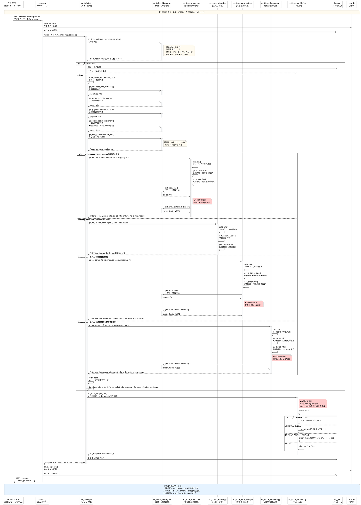

# EC関連問合せMockアプリケーション

## シーケンス図

## 概要
EC関連問合せ・発券・払戻し・完了通知のMockサーバのシーケンス図です。

### 今回の修正ポイント
- **要求区分B,H,J**（チケット発券取消、プリンタエラー発券取消、XMLファイル取得NG発券取消）で`order_details`辞書を生成
- **XMLレスポンス**に`order_details`要素を追加  
- **各処理モジュール**で`order_details`対応を実装

### 対象ファイル
- `ec_ticket.py` - order_details引数対応
- `ec_ticket_nomal.py` - 通常問合せ処理でorder_details生成追加
- `ec_ticket_complete.py` - 完了通知処理でorder_details生成追加
- `ec_ticket_kenmen.py` - 券面情報処理でorder_details生成追加
- `ec_ticket_xmldef.py` - order_details含むXMLテンプレート追加
